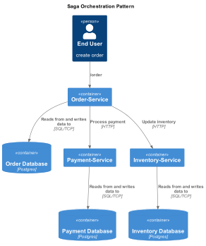
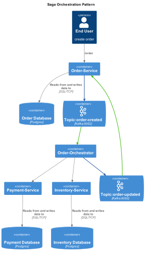

# SagaOrchestration Project

## Overview
In monolithic architecture, the entire business logic part of single application, we can modify multiple databases in a 
single transaction that allow ACID transactional guarantee. When the business transaction are across the services in
microservice based architecture and single database per microservice then it is difficult as a system to manage the ACID 
guarantee.



The above picture when user request for the new order, the request transactions are goes through order service, inventory
service and payment service to fulfill the order request. If there is a failure in one of this transaction steps then
it is difficult to guarantee of roll back.

### Resolution
The saga pattern breaks the transaction into sequence of operations that each microservice have to perform on success 
and compensation operation to reverse the changes to ensure data consistency.

### Saga Orchestration
A central orchestration service that manages the saga execution flow and coordinate with other services to make sure the
ACID transaction guarantee.



The sole purpose of the orchestration service is to orchestrate the transaction order correctly and apply the compensation
operations in the opposite order if anything goes wrong.


The SagaOrchestration project is a microservices-based architecture that includes four distinct services: Order Service, Inventory Service, Payment Service, and Order Orchestration. Each service is responsible for a specific domain and can be developed, deployed, and scaled independently.

## Modules

### Order Service
- **Description**: Manages customer orders and their lifecycle.
- **Location**: `OrderService/`
- **Main Class**: `OrderServiceApplication.java`

### Inventory Service
- **Description**: Handles inventory management and stock levels.
- **Location**: `InventoryService/`
- **Main Class**: `InventoryServiceApplication.java`

### Payment Service
- **Description**: Processes payments and manages transactions.
- **Location**: `PaymentService/`
- **Main Class**: `PaymentServiceApplication.java`

### Order Orchestration
- **Description**: Coordinates the interactions between the Order, Inventory, and Payment services to fulfill customer orders.
- **Location**: `OrderOrchestration/`
- **Main Class**: `OrderOrchestrationApplication.java`

## Setup Instructions
1. Clone the repository.
2. Navigate to the project root directory.
3. Use Gradle to build and run each service:
   - For each service, navigate to its directory and run:
     ```
     ./gradlew build
     ./gradlew bootRun
     ```

## Usage
- Each service exposes RESTful APIs that can be consumed by clients or other services.
- The Order Orchestration service acts as the entry point for order processing, invoking the necessary services in the correct sequence.

## Contributing
Contributions are welcome! Please submit a pull request or open an issue for any enhancements or bug fixes.

## License
This project is licensed under the MIT License. See the LICENSE file for more details.