# SagaOrchestration Project

## Overview
The SagaOrchestration project is a microservices-based architecture that includes four distinct services: Order Service, Inventory Service, Payment Service, and Order Orchestration. Each service is responsible for a specific domain and can be developed, deployed, and scaled independently.

## Modules

### Order Service
- **Description**: Manages customer orders and their lifecycle.
- **Location**: `OrderService/`
- **Main Class**: `OrderServiceApplication.java`

### Inventory Service
- **Description**: Handles inventory management and stock levels.
- **Location**: `InventoryService/`
- **Main Class**: `InventoryServiceApplication.java`

### Payment Service
- **Description**: Processes payments and manages transactions.
- **Location**: `PaymentService/`
- **Main Class**: `PaymentServiceApplication.java`

### Order Orchestration
- **Description**: Coordinates the interactions between the Order, Inventory, and Payment services to fulfill customer orders.
- **Location**: `OrderOrchestration/`
- **Main Class**: `OrderOrchestrationApplication.java`

## Setup Instructions
1. Clone the repository.
2. Navigate to the project root directory.
3. Use Gradle to build and run each service:
   - For each service, navigate to its directory and run:
     ```
     ./gradlew build
     ./gradlew bootRun
     ```

## Usage
- Each service exposes RESTful APIs that can be consumed by clients or other services.
- The Order Orchestration service acts as the entry point for order processing, invoking the necessary services in the correct sequence.

## Contributing
Contributions are welcome! Please submit a pull request or open an issue for any enhancements or bug fixes.

## License
This project is licensed under the MIT License. See the LICENSE file for more details.

```plantuml

@startuml

title Saga Orchestration Pattern

!include <C4/C4>
!include <C4/C4_Container>
!include <C4/C4_Component>

!include <cloudinsight/kafka>
!include <cloudinsight/cassandra>

scale 0.5
AddRelTag("kafka_link_outward", $textColor=#335DA5, $lineColor=#335DA5, $lineStyle=bold())
AddRelTag("kafka_link_inward", $textColor=#3FBA11, $lineColor=#3FBA11, $lineStyle=bold())


' External actor
Person(enduser, "End User", "create order")

Container(order_service, "Order-Service")
ContainerDb(order_db, "Order Database", $techn="Postgres", $sprite="postgres")
ContainerQueue(order_created, "Topic:order-created", "Kafka:9092", $sprite="kafka")
ContainerQueue(order_updated, "Topic:order-updated", "Kafka:9092", $sprite="kafka")
Container(order_orchestrator, "Order-Orchestrator")
Container(payment_service, "Payment-Service")
Container(inventory_service, "Inventory-Service")
ContainerDb(payment_db, "Payment Database", $techn="Postgres", $sprite="postgres")
ContainerDb(invnetory_db, "Inventory Database", $techn="Postgres", $sprite="postgres")

Rel(enduser, order_service, "/order")
Rel(order_service, order_db, "Reads from and writes data to",  $techn="SQL/TCP")
Rel(order_service, order_created, "", $tags="kafka_link_outward")
Rel(order_updated, order_service, "", $tags="kafka_link_inward")
Rel(order_created, order_orchestrator, "", $tags="kafka_link_inward")
Rel(order_orchestrator, order_updated, "", $tags="kafka_link_outward")
Rel(order_orchestrator, payment_service, "")
Rel(order_orchestrator, inventory_service, "")
Rel(payment_service, payment_db, "Reads from and writes data to",  $techn="SQL/TCP")
Rel(inventory_service, invnetory_db, "Reads from and writes data to",  $techn="SQL/TCP")



```

